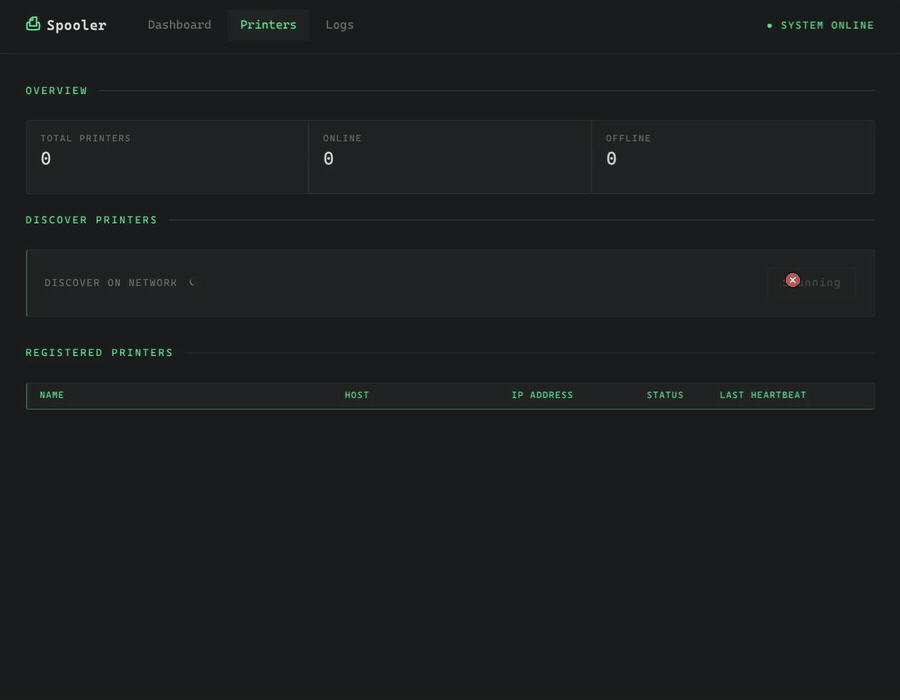

# PrintSpooler

A practice project meant to exercise the full .NET stack: API, background workers, Azure SQL, live updates.





## What it does

A print job comes in from the Blazor dashboard, gets written to the database, and is handed off to a background queue. From there it's dispatched to a real network printer over IPP. Its status gets polled directly off the device until it reaches a real terminal state: printing, completed, failed, whatever the printer actually reports. Every step is audit-logged, and status changes push back to the dashboard live over SignalR.


## Architecture

**Api** and **Infrastructure** both depend on **Core**, but Core depends on nothing. 
**Web** only depends on Core for its DTOs and talks to Api over plain HTTP plus SignalR.


| Project | Role |
|---|---|
| **Core** | Domain models, enums, service interfaces. No I/O. |
| **Infrastructure** | EF Core (SQL Server), IPP (SharpIppNext), mDNS (Zeroconf), background workers. |
| **Api** | Web API: controllers, SignalR hub, DI. Uses Infrastructure via Core interfaces. |
| **Web** | Blazor Server dashboard; `ApiClient` over `HttpClient` + SignalR. |


### Job flow

Sending a job from the dashboard is a `POST /PrintJob` that writes the job, its data, and an audit log entry, then queues a reference and returns immediately. The actual printing happens in the background. Each printer has its own dedicated monitor with a private queue: it dispatches one job at a time, waits for that job to reach a real terminal state on the device before pulling the next one, and reports status changes back over SignalR as they happen. A printer can never end up with two jobs in flight at once, but a slow job on one printer never blocks any other printer, since each one runs its own independent loop.


## Stack

Built on .NET 10 and C# 13: ASP.NET Core Web API with DI, health checks, and OpenAPI; EF Core 10 against Azure SQL (migrations, connection string in `user-secrets`); SignalR and Blazor Server for the live dashboard; SharpIppNext for IPP, Zeroconf for mDNS discovery, and ErrorOr for result handling.


## Run

```bash
conn string via dotnet user-secrets (Key:.ConnectionStrings:PrintSpoolerDb),
then:

dotnet run --project PrintSpooler.Api
dotnet run --project PrintSpooler.Web   # set ApiBaseAddress to the Api's URL
```

Print needs a real network printer on the API's LAN. Everything else (UI, queue, logs, SignalR) works without one; the job just lands as `Failed`.

## Layout

```
Core/          models, interfaces, enums
Infrastructure/ DbContext + migrations, workers, IPP, mDNS
Api/           controllers, SignalR hub, DTOs, DI
Web/           Blazor pages (Dashboard, Printers, Logs), ApiClient
```

